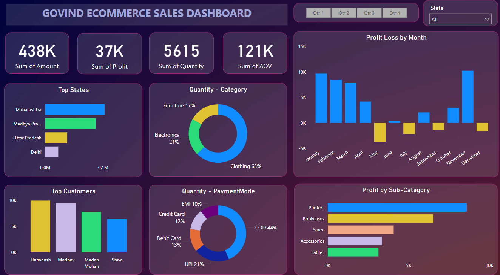

# Govind Ecommerce Sales Dashboard

## 🎯 Objective
The **owner of Govind Ecommerce** needed a comprehensive, interactive dashboard to:
- **Track** online sales performance across all Indian states.
- **Analyze** revenue, profit, order volumes, and payment behaviors.
- **Identify** monthly trends, top customers, and high-value product categories.

## 📝 Overview
This Power BI project transforms raw transaction data into a visually engaging dashboard that:
- Highlights **Key Performance Indicators** at a glance.
- Supports dynamic filtering by **Quarter** and **State**.
- Empowers stakeholders to make data-driven decisions.

## 📸 Dashboard Preview

## 📊 Key Performance Indicator (KPIs)

| KPI                      | Value   | Description                |
|--------------------------|--------:|----------------------------|
| **Total Sales**          | ₹438K   | Gross revenue              |
| **Total Profit**         | ₹37K    | Net gain after costs       |
| **Units Sold**           | 5,615   | Number of items sold       |
| **Average Order Value**  | ₹121    | Revenue per order          |

## 🔍 Visualization

1. **Top States**  
   Maharashtra leads with ~₹102 K, ahead of Madhya Pradesh and Uttar Pradesh.

2. **Quantity – Category**  
   Clothing makes up ~63%, Electronics ~21%, Furniture ~17%.

3. **Profit/Loss by Month**  
   Profits peak in January and November whereas highest losses occur in May and July.

4. **Top Customers**  
   Harivansh (~₹10 K) and Madhav (~₹9 K) are your biggest buyers.

5. **Payment Mix**  
   COD ~44%, UPI ~21%, Debit Card ~13%, Credit Card ~12%, EMI ~10%.

6. **Profit by Sub-Category**  
   Printers (~₹9 K) top margins, then Bookcases, Sarees, Accessories, Tables.

   ## 🏁 Results & Learnings
- Pinpointed Maharashtra as the sales leader and off-peak months needing targeted promotions.  
- Standardized raw transaction data and used Power Query for reliable, high-performance reporting.  
- Crafted interactive visuals (bar, donut, column, map) that lead users straight to critical insights.  
- Built a responsive, presentation-ready layout with slicers and drill-throughs for state- and customer-level analysis.  
- Refined color palettes, chart types, and KPI selection to balance detail and clarity.

